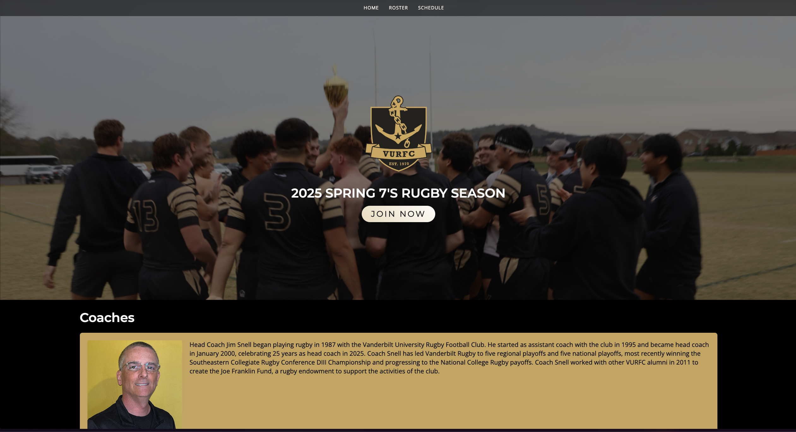

# Vanderbilt Rugby Official Website

## Project Overview

Official website for Vanderbilt Rugby developed with Astro framework and TypeScript,
featuring responsive design, team information, match schedules, and media galleries.



## Live Site

[Link to live website if available]

## Technologies

- Astro Framework
- TypeScript
- HTML/CSS
- Responsive Design
- Git/GitHub

## Features

- **Team Roster:** Dynamic player profiles and statistics
- **Match Schedule:** Upcoming games and results
- **News Section:** Latest team updates and announcements
- **Media Gallery:** Photos and videos from matches and events
- **Contact Forms:** Recruitment and general inquiries

## Development Approach

This project follows a component-based architecture with:

- TypeScript for type safety and improved developer experience
- Astro for improved performance and optimal asset loading
- Responsive design principles for mobile and desktop viewing
- Comprehensive documentation for future developers

## Local Development

```bash
# Clone repository
git clone https://github.com/augustomklee/vanderbilt-rugby-website.git
cd vanderbilt-rugby-website

# Install dependencies
npm install

# Start development server
npm run dev

# Build for production
npm run build
```
